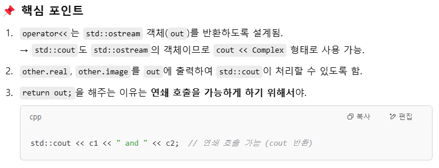

# iot_c-_2025
c++

## 31일차(3월18일)
- 01-1 입출력 방식

    - 입력 
        - 출력대상의 위치에는 정수, 실수, 문자열 , 변수 등 무엇이든 올 수 있다.
        - std::cout<< 출력대상; 
        - std::cout << 출력대상 << std::endl;       -개행문자\n포함
    ```c++
    /*
        cout -표준 출력 객체
    */
    #include <iostream>
    using namespace std;
    int main(){
        double d = 3.14;		
        std::cout<<"Hello World"<<std::endl;
        cout << d<< endl;
        return 0;
    }
    ```
    - 변수선언
    ```c++
    int num = 100;	//c 스타일 변수 선언
    int num2(200);	//c++스타일 변수 선언
    ```

    - 출력
        - std::cin >>변수명 ;
    ```c++
    #include <iostream>
    using namespace std;
    int main(void) {

        int inVal;
        cout << "숫자를 입력하세요:";
        cin >> inVal;
        cout << "inVal: " << inVal << endl;

        return 0;
    }
    ```
    - 입출력 실습 [C++](./day31/practice1.cpp)
- 01-2 함수 오버로딩    [C++](./day31/overloading.cpp)
    - c에서는 동일한 이름의 함수가 정의되는 것을 허용하지 않는다. 두 함수의 이름이 같기 때문에 컴파일 오류가 발생한다.
    - c++에서는 함수명,매개변수(타입, 개수)가 같아야 같은 함수로 인식한다.
    - 함수 오버로딩(함수의 다중정의)
        - 함수명은 같은데 매개변수의 타입이나 갯수가 다르면 다른함수이다.
        
        ```c++
        int func() {
        	return 10;
        }
        
        int func(char c) {
        	return c;
        }
        
        int func(int n) {
        	return 10 + n;
        }
        
        int func(int n1, int n2) {
            return n1 + n2;
        }
        ```
        - `반환값만 다르고 함수명,매개변수(개수, 타입)이 같은 것은 동일한 함수이므로 오버로드 불가이다.`
        ```c++
        int func(char c) {
        	return c;
        }
        
        //char func(char c) {
    	//    return c;
        //}
        ```
    - 함수 오버라이딩(함수의 재정의)    --> 상속
    - 함수 오버로딩 실습 [C++](./day31/practice2.cpp)
        - `포인터가 가리키는 값을 바꾸는 것이 목표인 경우, *a와 *b를 사용하여 간접 참조를 통해 값을 변경해야 합니다.`
        - a = b;를 쓰면, a가 이제 b가 가리키는 주소를 가리키게 됩니다. 하지만 원래 a가 가리키고 있던 값은 바뀌지 않게 됩니다.그리고 a와 b 포인터의 주소를 바꾸는 것 자체는 함수 종료 후에는 더 이상 의미가 없게 됩니다. 함수 내에서 a와 b가 가리키는 주소가 바뀌지만, 실제 값의 교환은 이루어지지 않기 때문입니다.
        ```c++
        #include <iostream>
        void swap(int*, int*);
        void swap(char*, char*);
        void swap(double*, double*);

        int main(void) {
        int num1 = 20, num2 = 30;
        swap(&num1, &num2);
        std::cout << num1 << ' ' << num2 << std::endl;
        return 0;
        }

        void swap(int* a , int* b){
            int temp;
            temp = *a;
            *a = *b;
            *b = temp;
        }
        ```
- 01-3 매개변수 디폴트 값    [C++](./day31/default.cpp)
    - `디폴트 값은 함수의 선언 부분에만 표현하면 된다.`
    - `default값은 반드시 오른쪽부터 채울 것`
    ```c++
    #include <iostream>

    int coordinates(int x, int y=0, int z=0); 
    int main(void) {

        std::cout << "coordinates(10,20,30):" << coordinates(10, 20, 30) << std::endl;
        std::cout << "coordinates(10, 20, def):" << coordinates(10,20) << std::endl;
        std::cout << "coordinates(10, def, def):" << coordinates(10) << std::endl;

        return 0;
    }
    int coordinates(int x, int y, int z) {
        int res;
        res =pow(x, 2) + pow(y, 2) + pow(z, 2);		//제곱
        return sqrt(res);							//제곱근
    }
    ```
    - 함수오버로딩 중에서 디폴트 매개변수와 입력이 없는 순수한 함수정의가 있을 때 
    입력없는 함수 호출시 문제가 발생한다. 
    ```c++
    #include <iostream>

    int func(int n = 0){
        return n * n;
    }

    int func() {
        return 10;
    }
    int main(void) {

       // std::cout << func() << std::endl;   에러난다. E0308
        return 0;
    }
    ```

- 01-5 이름공간 
    - 이름공간 기반의 함수선언과 정의의 구분
    ```c++
    #include <iostream>
    namespace aName {

        void func() {
            printf("aName::func()\n");
        }
    }
    namespace bName {

        void func() {
            printf("bName::func()\n");
        }
    }
    namespace cName {

        void func() {
            printf("cName::func()\n");
        }
    }

    using namespace cName;
    int main(void) {

        aName::func();
        bName::func();
        func();
        return 0;
    }
    ```
    - 범위지정 연산자
        - 전역변수
        ```c++
        #include <iostream>
        int val = 100; //전역변수
        int main(void) {
            int val = 20; //지역변수
            val += 3; //지역변수 +3 

            std::cout << "지역변수val:" << val << std::endl;   //23

            ::val += 3; //전역변수 + 3
            std::cout << "전역변수val:" << ::val << std::endl;  //103

            return 0;
        }
        ```
        - 헤더파일 호출 [C++](./day31/scope.h) [C++](./day31/scope.cpp)
        ```c++
        #pragma once

        class A{
            int a;
        public :
            A(int aa);
            void AInfo();
        };
        ```
        ```c++
        /*
	    범위 SCOPE
        */
        #include <iostream>
        #include "scope.h"

        A::A(int aa) {					//std::cout<< 형태와 동일
            a = aa;
        }
        void A::AInfo() {
            std::cout << "a: " << a << std::endl;
        }
        int main(void) {

            A a=10 ; //A a(10);
            a.AInfo();


            return 0;
        }
        ```

- 02-3 참조자 
    - 자신이 참조하는 변수를 대신할 수 있는 또 하나의 이름
    - 자신이 참조하는 변수와 동일한 메모리 공간을 가진다.
    - 참조자 선언 표시 & 
    ```c++
    #include <iostream>
    using namespace std;

    void chFunc(int& rn);		//참조변수 선언

    int main(void) {

        int n = 10;
        std::cout << "호출 전 n : " << n << std::endl;
        chFunc(n);
        std::cout << "호출 후 n : " << n << std::endl;
        
        return 0;
    }

    void chFunc(int& rn) {
        rn = 20;
    }
    ```
    - **선언과 동시에 초기화 되어야함.**
    ```c++
    #include <iostream>

    int main(void) {

        int num = 10;
        int& ref = num;	//num의 메모리 공간에 ref라는 별명이 붙는다.
        int* pn = &num; //포인터변수 선언
        
        //int& rref;    //선언과 동시에 초기화가 되어야함.
        //rref = ref;

        num++;
        ref++;
        (*pn)++;

        std::cout << "num++: " << num << std::endl;  //num++: 13
        std::cout << "ref++: " << ref << std::endl;  //ref++: 13
        std::cout << "(*pn)++: " << *pn << std::endl; //(*pn)++: 13
        std::cout << "&num:" << &num << std::endl;  //&num:00000016A0CFF604
        std::cout << "&ref:" << &ref << std::endl;  //&ref:00000016A0CFF604

        return 0;
    } 
    ```
    - 참조자의 수에는 제한이 없으며, 참조자를 대상으로도 참조자를 선언할 수 있다.  [C++](./day31/ref3.cpp)
    ```c++
    int num = 10 , num2 = 100;
    int& ref = num;	
    int* pn = &num; 

    int& rref = ref;
    std::cout << "rref:" << rref << std::endl;  //rref:10
    rref = num2;
    std::cout << "rref:" << rref << std::endl;  //rref:100
    ```

    - **상수레퍼런스(const 자료형  & )로 상수 참조자** [C++](./day31/ref4.cpp)  [C++](./day31/ref5.cpp)
    ```c++
    int n = 10;
    //int& ref = 10;   //참조자는 변수에 대해서만 선언이 가능하다.
    const int& ref = 10;   // 임시객체를 저장할 수 있는 공간이 생성된다.
    std::cout << "ref:" << ref << std::endl; //10
    ```
    - 함수의 출력값에 따른 경우
        - 함수 리턴값이 상수인 경우, 자료형 변수 또는 const 참조자;
        ```c++
        /*함수 리턴값이 상수*/
        int func(int anum) {
            anum++;
            return anum;     //리턴값은 상수이다.
        }

        int main(void) {

        int num = 10;
        int res = func(num);
        //int& res1 =func(num);   // 함수종료시 지역변수 anum은 사라짐
        const int& res1 =func(num);   // 리턴값을 상수레퍼렌스로 상수참조자
        
        std::cout << "num:" << num << std::endl;  //10
        std::cout << "res:" << res << std::endl;  //11
        std::cout << "res:" << res1 << std::endl; //11
        return 0;
        }

        ```
         - 함수 리턴값이 참조자인 경우, 자료형 변수 또는  참조자;
    
        ```c++
        /*함수 리턴값이 참조자*/
        int& func(int& anum) {
        anum++;
        return anum;				//리턴값은 참조자이다.
        //return anum++;  //rvalue이므로 참조할 수 없다. 참조자는 lvalue이어야한다.
        }

        int main(void) {

            int num = 10;
            int& res1 = func(num);      // res1은 참조자anum을 참조한다.
            int& res2 = res1;
            int res = func(num);
            std::cout << "num" << num << std::endl;
            std::cout << "res2" << res2 << std::endl;
            std::cout << "res" << num << std::endl;
            return 0;
        }

        ```


- 02-5 new , delete  메모리동적할당 
    - 여러 개의 메모리를 처리하려면 포인터 배열([C](./day31/new.cpp)), 하나의 메모리만 처리하려면 포인터 변수([C](./day31/new1.cpp))를 사용하면 됩니다. 
    - 메모리동적할당 
        - 자료형 포인터 = new 자료형의 크기;
        - delete 포인터;
        ```C++
        int *pn = new int; //힙영역에 int크기로 동적할당을 받는다.
        delete pn;

        int size=5;
        int* pary = new int[size];
        pary[0] = 1;
        *(pary+1) = 2;
        delete[] pary;
        ```
    - `생성자 - 객체를 생성하고, 초기화시키는 기능을 가지는 특별한 메서드`
    - **new - 생성자를 호출한다. new는 생성자를 호출이 되므로 초기화가 가능하다.**
    ```c++
    int* parr;
	parr = new int[3] {10, 20, 30};  //new는 생성자를 호출이 되므로 초기화가 가능하다.
    ```
- 03-1 구조체
    - C언어 구조체 [C++](./day31/struct_c.cpp)
    - C++구조체 [C++](./day31/struct_c++.cpp)
    ```c++
    #include <iostream>
    
    
    typedef struct human {
    
        char name[100];
    	int age;
    	char job[20];
    	
    	void showHuman() {
    		printf("name:%s, age:%d, jog:%s\n", name, age, job);
    	}
    }Human;
    
    int main(void) {
    
    	Human h = { "김철수",30,"백수" };
    	h.showHuman();
    
    	return 0;
    }
    ```
    - 구조체를 클래스 형태로 변환 [C++](./day31/struct_c++2.cpp)
        - 아래코드 생성자 코드 필요!!
        ```c++
        #include <iostream>

        class Human {
        public:   //외부접근 허용
            char name[100];
            int age;
            char job[20];


            //디폴트 생성자 (클래스명과 동일, 출력이 없다.)
            Human() {
                
            }

            void showHuman() {
                printf("name:%s, age:%d, jog:%s\n", name, age, job);
            }
        };
        int main(void) {

            Human h = { "김철수",32,"백수" };
            h.showHuman();

            return 0;
        }
        ```
## 32일차(3/19)
- 참조자 실습 
    - 상수참조자인 경우, 값변경 불가 [c++](./day32/prac_ref2.cpp)
    - 상수참조자를 통해 리터럴상수 연산  [c++](./day32/prac_ref6.cpp)
    - 반환형이 참조형인 경우 , 참조자변수일때 [C++](./day32/prac_ref4.cpp), 변수일때 [C++](./day32/prac_ref3.cpp)
    - 함수 내 지역변수를 참조자로 반환할 경우, 지역변수는 함수종료 후 소멸되기에 쓰레기값이다. [C++](./day32/prac_ref5.cpp)
    - const포인터와 const참조자 [C++](./day32/prac_ref7.cpp)
        - ref는 포인터 p를 참조하므로 ref와 p의 주소는 동일하다. =>*p == *ref
        ```C++
        #include <iostream>

        int main(void) {

            const int num = 12; //상수이므로 직접 변경 불가능, 포인터 변수나 참조자로 값 변경해야함
            const int* p = &num;   //데이터상수 (주소변경가능, 값변경 불가)
            
            const int* (&ref) = p;  
            std::cout << "포인터 변수 p가 가리키는 값: " << *p << std::endl;
            std::cout << "참조자 ref: " << *ref << std::endl;

            return 0;
        }
        ```
- 동적할당 + 참조자 실습 [c++](./day32/prac_newdelete2.cpp)
    - 동적할당은 포인터 변수
    - 포인터변수의 값을 참조
    ```c++
    Point &ref = *p;
    //p가 가리키는 값 = ref
    //p의 주소 = ref의 주소

    //p의 동적할당해제 = ref의 주소의 동적할당 해제

    ```
    ```c++
    #include <iostream>
    typedef struct __Point {
        int x;
        int y;
    } Point;
    
    Point& PntAdder(const Point& p1, const Point& p2) {
        Point* p  = new Point;
        p->x = p1.x + p2.x;
        p->y = p1.y + p2.y;
        return *p ;
    }

    int main(void) {
        Point* p = new Point;
        Point* q = new Point;
    
        (*p).x = 1;
        (*p).y = 2;
        (*q).x = 3;
        (*q).y = 4;
    
        Point& ref = PntAdder(*p, *q);  // PntAdder 함수에서 참조 반환
        std::cout << "두 점의 합(x, y): " << ref.x << " " << ref.y << std::endl;
    
        // 동적 할당 해제
        delete p;
        delete q;
        delete &ref; 
        return 0;
    }

    ```
- **문자열처리하기 -strcpy()**[C++](./day32/문자열처리하기.cpp)
- 03-2 클래스와 객체
    - 객체와 인스턴스
    - 인스턴스 -어떤 클래스로부터 만들어진 객체
    - `객체를 생성하기 위해는 생성자호출이 필요하다.`
    - 클래스
        - 구성요소
            - 접근제어 지시자(private, public, protected)
            - 멤버변수 - private
            - 멤버함수  - public
        - 클래스 내에 선언된 변수는 클래스 내에 선언된 함수에서만 접근 가능하다.
        - 클래스명의 첫글자는 대문자이다.
        - 생성자는 멤버함수이다.
        - 클래스의 인스턴스 객체 선언 후 멤버함수의 생성자로 초기화한다.
    - 생성자
        - 클래스명과 동일
        - 출력자체가 없다. void도 적지 않는다. 
        - `디폴트 생성자 호출은 괄호 생략해야한다. 이유는 main함수내에서의 함수선언 식과 구분하기 위해서이다.`(교재 172쪽)
        ```c++
        class AClass {

        private :
            int n1;
            int n2;
        public :
            AClass(){}

        };

        int main(void) {

        AClass b; //디폴트 생성자
        AClass b2 =  AClass(); //디폴트 생성자
        //AClass b3(); //함수원형과 헷갈리기에 에러난다.
        //AClass b(200, 400); //입력이 2개인 생성자는 정의되어있지 않다. 에러(E0289)
        return 0;
        }
        ```


        - 사용자 정의 생성자가 정의되고 디폴트생성자가 정의되지 않을 경우, 디폴트생성자 객체 생성 안된다.
        ```c++
        #include <iostream>


        class MyClass {

        private :
            int m_num1;
            int m_num2;

        public :
            MyClass(int a, int b) {
                m_num1 = a;
                m_num2 = b;
            }

            void printData() {
                std::cout << "나는 MyClass의 인스턴스입니다. ";
                std::cout << "m_num1: " << m_num1 << " m_num2: " << m_num2 << std::endl;
            }
        };
        int main(void) {
            //MyClass obj; //디폴트 생성자가 없다는 에러 E0291
          
            MyClass obj2(100, 200);
            obj2.printData();
            return 0;
        }
        ```
        - 생성자 오버로딩 - 함수명 동일, 매개변수(개수, 값) 다름
        ```C++
        #include <iostream>


        class MyClass {

        private :
            int m_num1;
            int m_num2;

        public :
            MyClass(){}

            MyClass(int a, int b) {
                m_num1 = a;
                m_num2 = b;
            }
        
        };
        ```
    - 소멸자 ~
        - 클래스의 이름 앞에 '~'가 붙은 형태의 이름을 갖는다.
        - 출력자체가 없다. void도 적지 않는다.
        - 매개변수는 void형으로 선언되어야 하기에 오버로딩도, 디폴트 값 설정도 불가능하다.
        - 직접 소멸자를 정의하지 않으면, 디폴트생성자와 마찬가지로 아무런 일도 하지 않는 디폴트 소멸자가 자동으로 삽입된다.
        - 소멸자는 대개 생성자에서 할당한 리소스의 소멸에 사용된다.(delete연산자 이용)
        - `동적할당 경우 말고는 별도로 작성할 필요가 없다. 동적해제를 소멸자 함수에서 한다.`
    - 클래스 실습
        - 멤버변수가 str일 때, set함수로 [c++](./day32/MyClass.cpp)
        - 멤버변수 str일 때, 생성자로  [c++](./day32/MyClass2.cpp)
        - 멤버변수 str일 때, 생성자 + 동적할당 [c++](./day32/MyClass3.cpp)
        - ` C++에서 생성자에서 배열의 주소를 포인터로 받을 때 const를 사용하는 이유:  배열의 값이 변경되지 않도록 보호/ const를 사용하면 해당 포인터가 가리키는 메모리의 값을 수정할 수 없게 됩니다. `
        - `strlen(배열이름)은 배열의 첫 번째 요소의 주소를 반환하는 포인터를 사용하여 문자열의 길이를 구합니다`
        - `동적 메모리 할당을 통해 포인터가 문자열을 가리키는 경우에도 strlen(포인터)를 사용하여 문자열의 길이를 계산할 수 있습니다.`
            ```c++
            MyClass(int i_id, const char* i_name, int i_age){   // const 포인터변수인 이유는 데이터상수 목적으로 (값변경 불가)
                id = i_id;

                //std::cout << strlen(i_name) << std::endl;
                name = new char[strlen(i_name)+1];  // 포인터변수=배열이름=배열의 첫번째주소 =>str(배열이름)   
                                                    // 동적 메모리 할당 시 +1을 하는 이유는 널 종료 문자(null terminator, '\0')를 저장하기 위해서입니다.
                strcpy(name, i_name);


                age = i_age;
            }
            ```
        - 범위지정:: , const , mutable  [c++](./day32/MyClass3copy.cpp)
            - `클래스밖에서 멤버함수 정의할 때, 범위지정::`
            - printData()함수는 출력만 하는 역할이니 값변경 하면 안 되므로 const
            - mutable 
            ```c++
            #define _CRT_SECURE_NO_WARNINGS
            #include <iostream>

            class MyClass {

            private:
                int id;
                char* name;
                mutable int age;

            public:
                MyClass() {}

                MyClass(int i_id, const char* i_name, int i_age);

                void printData () const;

                ~MyClass() {

                    delete[] name;
                }
            };

            int main(void) {

                MyClass m(5, "오수아", 32);
                m.printData();

                return 0;

            }


            MyClass::MyClass(int i_id, const char* i_name, int i_age) {  
                id = i_id;

                name = new char[strlen(i_name) + 1];  
                strcpy(name, i_name);

                age = i_age;
            }

            void MyClass:: printData() const{           //상수 멤버함수(모든 멤버들을 상수화 시킨다.)
                std::cout << "MyClass의 인스턴스입니다.";
                std::cout << "아이디: " << id << " 이름 :" << name << " 나이: " << age << std::endl;
               //id = 2;   //상수함수라서 id, name, age는 상수이기에 lvaule가 될 수 없다.
                age = 25;  //상수함수라서 age도 상수여야하지만 클래스 멤버변수에서 mutable을 통해 상수화를 막기에 lvalue가 변수라서 될 수 있다.
            }
            ```
        
- 초기화
    - **상수와 참조자는 선언과 동시에 초기화가 되어야한다.**
    - 초기화 유형
        ```c++
        #include <iostream>

        int main(void) {

            int num = 3;	// 복사초기하
            int num2(30);	//직접 초기화
            int num3{ 300 }; //중괄호 직접 초기화
            int num4 = { 3000 }; //중괄호 복사초기화

            int x = 3.14;
            int x1{3.14};		//double에서 int로의 변환에는 축소변환필요하다. 오류C2397

            std::cout << num << std::endl;
            std::cout << num2 << std::endl;
            std::cout << num3 << std::endl;
            std::cout << num4 << std::endl;
            std::cout << x << std::endl;     //3


            return 0;
        }
        ```
    - **이니셜라이져, 콜론 초기화 - 생성자 함수 머리에서 : 초기화**
        1. `상수 멤버변수를 가질 경우, 콜론 초기화`
        ```c++
        class ConstClass {

        private:
            int m_value;
            const int m_value2;   //상수멤버변수는 객체생성되기 전에 반드시 초기화가 되어야 함.

        public:
            ConstClass(int value, int value2) :m_value2(value2) { 
                m_value = value; /*m_value2 = value2;*/     //lvalue는 상수가 될 수 없다.
            } 

        };
        ```
        2. `참조자 reference 경우, 콜론 초기화`
        ```c++
        class RefClass {

        private:
            int& ref;

        public :
            RefClass(int& r) :ref(r) { }      //참조자 역시 객체가 생성되기 전에 반드시 초기화가 되어야 함.
            void showValue() {
                printf("참조자ref:%d", ref);
            }
        };
            int main(void) {
                int n = 50;
                RefClass obj(n);
                obj.showValue();
                return 0;
        }
        ```
        3. `멤버변수가 객체(class)인 경우, 콜론 초기화`
        ```c++
        #include <iostream>

        class Position {

        private:
            int m_x;
            int m_y;

        public:
            Position(int x, int y) { 
                printf("position객체 생성\n");
                m_x = x;
                m_y = y;
            }
            
            void getData() {
                printf("(x,y)=(%d,%d)\n", m_x, m_y);
            }
        };

        class ObjClass {
        private:
            Position pos;		//객체 멤버변수

        public :
            ObjClass(int x, int y) : pos(x, y) { printf("ObjClass객체 생성\n"); }   //ObjClass가 생성되기 전에 멤버변수로 Position객체가 생성되어야 한다. 
            void showValue() {
                pos.getData();
            }
        };

        int main(void) {

            ObjClass o(3,6);
            o.showValue();
            return 0;
        }
        ```
## 33일차(3/20)
- `자동으로 제공 :  디폴트생성자, 디폴트소멸자, 디폴트복사생성자`
- 05-01 복사생성자 ,05-02 깊은 복사, 얕은 복사
    - 자동으로 삽입이 되는 디폴트 복사 생성자
    ```c++
    /*
	복사생성자(copyConstructor)
    */
    #define _CRT_SECURE_NO_WARNINGS
    #include <iostream>
    class Person {

    private:
        int age;
        char name[20];

    public :
        Person(int i_age, const char* c){
            std::cout << "Constructor call~" << std::endl;
            age = i_age;
            strcpy(name, c);
        }
        void getData(){
            std::cout << "age: " << age << " , name: " << name << std::endl;
        }
    };


    int main(void) {
        Person p(20,"정해성");  //생성자 Person(int i_age, const char* c)
        p.getData();

        Person p2(p);	//디폴트 복사생성자
        p2.getData();

        Person p3 = p;  //디폴트 복사생성자
        p3.getData();

        return 0;
    }
    ```
    
   
    - 디폴트 복사생성자 명시적 [c++](./day33/copyContructor2.cpp)
        - **매개변수로 객체를 받을 수 없다. 복사생성자가 무한반복되기 때문이다.**
        - **매개변수로 객체를 받을려면 상수 참조연산자 (const & )를 적어야한다.**
        ```c++
        Person(const Person& other) {
            age = other.age;
            strncpy(this->name, other.name , strlen(other.name)+1 ) ;  //널문자포함
        }
        ```
    - 디폴트 복사생성자 명시적 동적할당 +깊은복사  [c++](./day33/copyContructor3.cpp)
        - 동적할당은 char* c , c = new char[size] , strcpy(c, "문자열"), delete [] c 
        - 생성자로 만든 인스턴스 p, 복사생성자로 만든 인스턴스 p2는 주소는 다르지만 값은 같다.
        - 깊은 복사일 경우, 동적할당해제는 각각 된다.
        - 얕은 복사일 경우, 동적할당이 같은 곳을 가리키기에 하나의 인스턴스가 사라지면 나머지 하나의 동적해제에서 에러난다.

- 그 외 생성자
    - 변환생성자 
        - 다른 타입의 객체로 변환될 때 자동으로 호출되는 생성자
        - 입력을 한개만 가지는 생성자와 유사
            ```c++
            #include <iostream>


            class Time {

            private:
                int hour;
                int min;
                int sec;

            public:
                Time() {	}
                Time(int abssec) {
                    hour = abssec / 3600;
                    min = (abssec / 60) % 60;
                    sec = abssec % 60;
                }
                void printTime() {
                    printf("현재시간은 %d시 %d분 %d초 입니다.\n", hour, min, sec);
                }
            };

            int main(void) {
                //Time now(9999);	//매개변수가 1개인 생성자
                Time now = 9999;   //변환생성자 (int -> Time)
                now.printTime();
                return 0;
            }

            ```
        - 변환에 의한 초기화(변환생성자)는 explicit으로 막을 수 있다.
            ``` c++
            /*
            explicit - 변환생성자 못함. 
            */

            #include <iostream>

            class MyClass {

            private:
                int value;

            public:
                explicit MyClass(int value) {
                    std::cout << "변환생성자 호출" << std::endl;
                    this->value = value;
                }
                void printMyClass() {
                    std::cout << "value: " << value << std::endl;
                }
            };
            int main(void) {
                
                //MyClass obj = 10;		//변환생성자
                //obj.printMyClass();

                MyClass obj2(20);		//생성자
                obj2.printMyClass();
                return 0;
            }
            ```
    - 이동생성자 [c++](./day33/moveConstructor2.cpp)
        - 이동 생성자는 r-value 참조(&&)를 파라미터로 받으며, 자원을 복사하는 대신 이동시키는 방식으로 성능을 최적화합니다.
        ```c++
        /*
            이동생성자(&&)
            r-value 참조를 파라미터로 갖는 이동 생성자
        */
        #define _CRT_SECURE_NO_WARNINGS
        #include <iostream>

        class Human {
        private:
            char name[10];
            int age;
        public:
            //입력이 2개인 생성자 (생성자 오버로딩)
            Human(const char* name, int age) {
                std::cout << "입력이 2개인 생성자(생성자 오버로딩)" << std::endl;
                strcpy(this->name, name);
                this->age = age;
            }
            //복사생성자
            Human (const Human& other){
                std::cout << "복사생성자(const, 참조연산자&)" << std::endl;
                strcpy(this->name, other.name);
                this->age = other.age;
            }
            //이동생성자 - 값 복사가 아니라 값이 이동이다.
            Human(Human&& other) noexcept{
                std::cout << "이동생성자(r-value참조)" << std::endl;
                strcpy(this->name, other.name);
                this->age = other.age;
            }
            void printHuman() {
                printf("[이름|나이] %s %d\n", this->name, this->age);
            }
        };
        int main(void) {
            
            Human h("day6", 4);
            std::cout << "h의 주소" << &h << std::endl;  //h의 주소0000002773B8F698
            h.printHuman();
            Human h2(h);
            std::cout << "h2의 주소" << &h2 << std::endl; //h2의 주소0000002773B8F6C8
            h2.printHuman();
            Human h3(std::move(h));
            std::cout << "h3의 주소" << &h3 << std::endl; //h3의 주소0000002773B8F6F8
            h3.printHuman();
            return 0;
        }
        ```

## 34일차(3/21)
- **함수의 매개변수로 사용자 정의 클래스 객체(인스턴스)가 들어갈 때는 참조로 받는 것이 효율적입니다**
- C++에서 기본 자료형(int, float, double, char, 등)을 함수 매개변수로 받을 때는 값으로 받는 것과 참조로 받는 것 사이에 큰 성능 차이가 없습니다.
- nullptr은 "이 포인터는 아무것도 가리키지 않는다" 라는 의미를 정확하게 전달합니다.
- 함수에 const를 붙이는 의미 - 그 함수 내부에서 멤버 변수를 변경할 수 없게 됩니다.
    ```c++
    //const 멤버 함수 특징
        //이 함수는 멤버 변수를 수정할 수 없음
        void showValue() const { 
            std::cout << "Value: " << m_value << std::endl;
        }

        // 이 함수는 멤버 변수를 변경할 수 있음 (const 없음)
        void setValue(int value) {  
            m_value = value;
        }
    ```

- 클래스 멤버함수에서 객체 덧셈 함수 
    - return값이 객체인 경우 [c++](./day34/operator3.cpp)
    ```c++
    public:
        //생성자
        Position(int ax=0, int ay=0) : x(ax),y(ay) {}
        //덧셈함수
        Position add(const Position& other){
            return Position(x+other.x , y+ other.y);
        }
    ```
    - return값이 참조인 경우  [c++](./day34/operator4.cpp)
    ```c++
    public:
        //생성자
        Position(int ax=0, int ay=0) : x(ax),y(ay) {}
        //덧셈함수
        Position& add(const Position& other){
            x += other.x;
            y += other.y;
            return *this;
        }
    ```
- 오버로딩 - 매개변수 타입, 개수가 다름 ,
    - 함수오버로딩 -매개변수 타입, 개수가 다름 /함수명 동일 /반환값은 관계없음
    - 생성자오버로딩 - 생성자명동일(클래스명) /매개변수 타입과 개수 다름
    - 연산자오버로딩


- 10-1 연산자 오버로딩
    - 필요성
        - 내장된 자료형 (int, char, 배열) 등은 대입연산, 산술연산 등이 가능하다.
        - `사용자 정의 자료형(class)에서 연산에 관련된 것을 가능하도록 하기 위해서이다`
        
    -  컴파일러가 자동으로 제공하는 "디폴트 대입 연산자(기본 대입 연산자)"를 호출 
         ```c++
        #define _CRT_SECURE_NO_WARNINGS
        #include <iostream>

        class MyClass {

        private:
            int m_a, m_b;
            const char* m_name;

        public:
            /*
            nullptr은 "이 포인터는 아무것도 가리키지 않는다" 라는 의미를 정확하게 전달합니다.
            nullptr은 nullptr_t 타입을 가지므로, 정수(int 등)로 변환되지 않아 의도치 않은 동작을 방지합니다
            */
            MyClass(int a =0 , int b = 0, const char* name = nullptr) : m_a(a), m_b(b), m_name(name) {
            
            }

            void showMyClass() {
                std::cout << m_a << ", " << m_b << ", " << m_name << std::endl;
            }
        };

        int main(void) {

            MyClass obj(3, 21, "window");
            obj.showMyClass();

            /*
            클래스 MyClass에는 명시적으로 기본 생성자가 정의되어 있지 않지만, 
            모든 매개변수에 기본값이 제공된 생성자 가 있기 때문에, 
            이를 이용하여 기본 생성자가 자동으로 제공됩니다.
            */
            MyClass obj2;
            obj2 = obj;		// 연산자 오버로딩을 사용한 것이 아니라, 컴파일러가 자동으로 제공하는 "디폴트 대입 연산자(기본 대입 연산자)"를 호출
            obj2.showMyClass();
            return 0;
        }
        ```

    - 연산자 오버로딩을 통해 operator+를 직접 정의 
        -  C++에서 클래스에 대한 덧셈(+) 연산자는 기본적으로 제공되지 않기 때문입니다. [C++](./day34/operator2.cpp)
        1. 멤버함수에 의한 연산자 오버로딩  p1 operator+ (p2)
        ```c++
        MyClass operator+(const MyClass& other) {
            return MyClass(value+other.value);
        }

        ```
        ```c++
        MyClass& operator+(const MyClass& other) {
            value += other.value;
            return *this;
        }
        ```

        ```c++
        
        int main(void){

            Myclass obj(10);    //입력이 1개인 생성자
            MyClass obj2 (obj); //복사생성자
            MyClass obj3 = obj2 //복사생성자

            Myclass obj4  = obj + obj2 ; //연산자 오버로딩 + 복사생성자
            //Myclass obj4  = obj.operator+(obj2) ; 
            
            //  MyClass operator+(const MyClass& other)  로 obj4생성하면 main함수 내 객체생성이 총 5번
             //MyClass& operator+(const MyClass& other)로 obj4생성하면 main함수 내 객체생성이 총 4번
        }
        ```

        2. 전역함수에 의한 연산자 오버로딩 operator+ ( p1 ,p2)  [c++](./day34/operator7.cpp)
            - inline 함수의 동작 원리 - 함수의 호출이 "호출"이 아니라, 그 함수의 코드 자체로 대체된다는 것입니다.
            ```c++
            inline Point operator+(int n, const Point& other);  //함수선언

            int main(void) {
                Point obj(10, 20);
                
                //전역함수
                Point obj2 = operator+(20 ,obj);    //함수의 호출이 "호출"이 아니라, 그 함수의 코드 자체로 대체된다는 것입니다.
                obj2.showPoint();

                return 0;
            }
            //함수정의
            inline  Point operator+(int n , const Point& other){
                return Point(n + other.x, n + other.y);
            }
            ```
            - **전역 함수로 연산자 오버로딩을 할 때, 참조 반환 (&)을 사용하려면 지역 객체를 반환할 수 없습니다.**
                - 함수 내부에서 생성한 지역 객체는 함수가 끝나면 소멸됩니다.
                - 따라서 지역 객체의 참조를 반환하면 함수가 종료된 후 해당 참조가 가리키는 메모리는 사라지므로 잘못된 참조(lvalue)가 됩니다.
            - **객체를 반환할 때는 보통 값 반환이 가장 안전한 방법이다.**
             
             
             
    -  friend 키워드 [c++](./day34/operator8.cpp)
        - private로 선언된 멤버변수를 전역함수에서 접근하려면 friend를 앞에 적고 함수선언을 멤버함수 내에서 해줘야 한다.
        ```c++
            #include <iostream>

            class Complex {

            private:
                double real, image;

            public:
                Complex(double r = 0, double i = 0) :real(r), image(i) {}

                Complex operator+(const Complex& other) {
                    return Complex(real + other.real, image + other.image);
                }

                /*함수원형에 freind선언을 하면 private 또는 protected 멤버변수 접근 가능*/
                friend Complex operator*(int n, const Complex& other);
                
                void showComplex() {
                    printf("%.1lf %.1lf\n", real, image);
                }

            };

            inline Complex operator*(int n, const Complex& other) {
                return Complex(n * other.real, n * other.image);
            }
        ```
        - 특정 함수나 다른 클래스를 friend로 선언하면 private 멤버에 접근 가능.
        - 보통 외부 함수 또는 다른 클래스가 내부 데이터를 직접 조작할 수 있도록 할 때 사용.

    - 연산자 오버로딩을 통해 operator<<를 직접 정의 
        - C++의 std::cout은 기본 데이터 타입(int, double, char 등)에 대해서는 << 연산자를 제공하지만, 사용자 정의 클래스(예: Complex 객체)는 기본적으로 지원하지 않음
        - **출력 연산자는 반드시 std::ostream&을 반환해야 한다!**
        - 전역 함수 연산자 오버로딩은 객체를 반환하는 경우가 많지만, operator<<은 예외적으로 std::ostream&을 반환
        

        ```C++
        // 출력 연산자 오버로딩 함수
        inline std::ostream& operator<<(std::ostream& out, const Complex& other) {
            out << other.real << ", " << other.image;
            return out;
        }
        ```
       
        ```C++
        Complex c(1.1, 2.2);
        std::cout << c << std::endl;
        ```
       

       1. 출력연산자 오버로딩 + private , friend 키워드
        ```c++
        #include <iostream>

        class MyClass {
        private:
            int value;
        public:
            MyClass(int n) :value(n){}
            friend std::ostream& operator<< (std::ostream& out, const MyClass& other);
        };

        std::ostream& operator<< (std::ostream& out, const MyClass& other) {
            out << other.value;   //private 멤버변수 접근 위해 friend 필요하다.
            return out;
        }
        int main(void) {
            MyClass obj(41);
            std::cout << obj << std::endl;   //출력 연산자 오버로딩 필요하다.
            return 0;
        }
        ```
        2. 출력연산자 오버로딩 연쇄출력 [c++](./day34/coutOperator2.cpp)
        ```c++
        /*연쇄출력*/
        /*출력 연산자 오버로딩*/
        #include <iostream>

        class Money {
        private:
            int money;
        public:
            Money(int m = 0) : money(m) {}  // 생성자

            // 출력 연산자 오버로딩
            friend std::ostream& operator<<(std::ostream& out, const Money& other) {
                out << "현재 금액: " << other.money;
                return out;  // 출력 스트림을 반환하여 연쇄 출력이 가능하도록 함
            }
        };

        int main() {
            Money m1(10000), m2(20000), m3(30000);

            // 연쇄 출력: 여러 개의 출력이 한 줄로 연결되어 출력됨
            std::cout << m1 << ", " << m2 << ", " << m3 << std::endl;

            return 0;
        }

        ```
    - 연산자 오버로딩 깊은 복사 [C++](./day34/Human2.cpp)
        - 기본적으로 C++에서 컴파일러가 제공하는 디폴트 대입 연산자는 얕은 복사(Shallow Copy)입니다.
        - 주의할 점
            - char * name이 초기화되지 않아 쓰레기 값(잘못된 포인터 주소)을 가질 가능성이 높아.
                - xman이 생성될 때, name에 nullptr이 아닌 쓰레기 값이 들어갈 수 있음.
                - operator=를 호출하면, delete[] name;이 실행됨.
                - 하지만 name이 올바른 메모리를 가리키지 않으면 런타임 오류(크래시) 발생!
            - 기존 메모리 해제 
            ```c++
            //#define _CRT_SECURE_NO_WARNINGS
            #include <iostream>
            class Human {
            private:
                char* name;
                int age;
            public:
                Human(const char* pn = nullptr, int i_age =0)   {
                    std::cout << "생성자" << std::endl;
                    age = i_age;
                    
                    if (pn) {
                        name = new char[strlen(pn) + 1];
                        strcpy(name, pn);
                    }
                    else {
                        name = new char[1];
                        name[0] = '\0';
                    }   
                }

                Human(const Human& other) {
                    std::cout << "복사생성자" << std::endl;
                    name = new char[strlen(other.name) + 1];
                    strcpy(name, other.name);
                    age = other.age;
                }

                ~Human() {
                    std::cout <<"소멸자" << std::endl;
                    delete[] name;
                }

                //깊은 복사- 대입연산자 오버로딩
                Human& operator= (const Human& other) {
                    if (this != &other) {  // 자기 자신 대입 방지
                        delete[] name;  // 기존 메모리 해제 (중요!)

                        name = new char[strlen(other.name) + 1];  // 새로운 메모리 할당
                        strcpy(name, other.name);
                        age = other.age;
                    }

                    return *this;
                }

                void showHuman() {
                    std::cout << name << ", " << age << std::endl;
                }
            };


            int main(void) {
                Human man("홍명보", 30);		//생성자
                man.showHuman();

                Human copyman(man);				//복사생성자
                copyman.showHuman();

                Human xman;
                xman=copyman;				//대입연산자 호출 - 얕은 복사면 에러나기에 대입연산자 오버로딩 필요하다.
                xman.showHuman();
                return 0;
            }
            ```
    - 연산자 오버로딩이 불가능한 연산자의 종류
        - . 멤버접근 연산자
        - .* 멤버 포인터 연산자
        - :: 범위지정 연산자
        - ?: 조건연산자
        - sizeof 바이트 단위 크기 계산
        - typeid RTTI 관련 연산자
        - static_cast, dynamic_cast, const_cast, reinterpret_cast 형변환 연산자

- 10-2 단항연산자 오버로딩
    - operator++와 operator--는 객체의 값을 증가/감소
    - operator-는 객체 값의 부호를 반전시키는 데 유용합니다.
    - operator!는 논리 부정 연산을 할 수 있게 하며, operator~는 비트 반전을 처리할 수 있습니다.
    - operator()는  함수 호출 연산자
    1. operator()
    ```c++
    #include <iostream>

    class Money {

    private:
        int money;
    public:
        Money(int m=0) :money(m) {}   //생성자

        int operator()() {            //단항연산자 오버로딩 - 매개변수 없는 경우
            return money;
        }

        void operator()(int m) {		 //단항연산자 오버로딩 - 매개변수 있는 경우
            money += m;
        }
    };

    int main(void) {
        Money m;			// 생성자로 인스턴스 생성
        printf("money: %d\n", m.operator()());
        
        m(1000);     // m.operator()(1000)과 동일
        printf("money: %d\n", m.operator()());


        return 0;
    }
    ```
- 매크로 함수와 인라인 함수
    1. 매크로 함수
        - #define을 사용하여 코드의 특정 부분을 자동으로 치환하는 방식
        - 매크로는 전처리기에서 실행되므로, 컴파일 전에 코드가 변환되는 특징
        - `매크로는 매개변수들을 괄호로 감싸서 계산해주어야 합니다. 그렇지 않으면 연산 순서가 잘못될 수 있습니다`
        
        ```c++
        #define ADD(a, b)  ((a) + (b))

        #define ARRAY_SIZE(arr) (sizeof(arr) / sizeof(arr[0]))

        #define MAX(a, b) ((a) > (b) ? (a) : (b))
        #define MIN(a, b) ((a) < (b) ? (a) : (b))

        #define SQUARE(x) ((x) * (x))

        #define LOG_INFO(msg) std::cout << "[INFO] " << msg << std::endl;
        ```
        - C++에서 문자열 리터럴을 연속으로 나열하면 자동으로 하나의 문자열이 됨.
            - #(해시기호) -  매크로의 인자를 문자열로 변환함
            - ##(더블 해시 기호) - 매크로의 인자들을 토큰 결합함.
            ``` C++
            #define ADD(a, b)   #a"+"#b   
            #define CONCAT(a, b) a ## b  // 매크로가 두 인자를 결합해서 하나의 변수명으로 만듦.

            int main() {
                int xy = 10;  // "x"와 "y"가 결합된 변수명 "xy"
                
                printf("ADD(a,b):%s\n", ADD(10, 20));  //10+20
                std::cout << CONCAT(x, y) << std::endl;  // "xy"라는 변수명 출력
                return 0;
            }
            ```

    2. 인라인 함수
        - 함수 호출을 실제 코드로 교체하는 기법
        - 함수 내용을 호출하는 위치에 직접 삽입하는 방식으로 동작합니다.
        ```C++
        #include <iostream>

        inline int func(int x) {				//인라인 함수
            return x * x;
        }
        int main(void) {
            /*
             컴파일러가 x * x로 대체하고, 실제로는 func(2)라는 함수 호출이 일어나지 않습니다.
            */
            std::cout << func(2) << std::endl;  //4
            return 0;
        }
        ```

- 13-1 템플릿 
    - 템플릿은 선언과 함수정의가 분리될 수 없다.  
    1. 함수 템플릿 기본 [C++](./day34/templete2.cpp)
        1. 템플릿 선언 일반화
        ```c++
        template <typename T>	
        T func(T a, T b) {
            std::cout << "T" << std::endl;
            return a + b;
        }
        ```
        2. 템플릿 특수화
        ```c++
        template<>				//템플릿 특수화- 템플릿 일반화 중 특별한 타입만 처리
        int func<int>(int a, int b) {
            std::cout << "int" << std::endl;
            return a + b;
        }
        ```
    2. 함수 템플릿의 typename이 여러개인 경우 [C++](./day34/templete3.cpp)
        ```c++
        template <typename T, typename T2>
        void func(T a, T2 b) {
            std::cout << a << std::endl;
            std::cout << b << std::endl;
        }
        ```
    3. 클래스 템플릿 기본
        - `인스턴스 생성시 반드시 typename을 작성해야한다.`
        ```c++
        template < typename T>
        class CTemplete {
        private:
            T data;
        public:
            CTemplete(T d) : data(d){}
            T getData() {
                return data;
            }
        };

        #include <iostream>

        int main(void) {
            CTemplete<int> obj(100);
            printf("data: %d\n", obj.getData());

            CTemplete<std::string> obj2("클래스템플릿테스트");
            std::cout << "data: " << obj2.getData() << std::endl;
            return 0;
        }

        ```
    - `std::string을 사용하는 이유`
        
        

    
    4. 클래스 템플릿 일반화, 특수화 [c++](./day34/templete5.cpp)
    ```c++
    #include <iostream>

    template <typename T>
    class CTest {				//클래스 템플릿 일반화
    private:
        T num;
    public:
        CTest (T n) : num(n){}
        T getData() { 
            return num;
        }

    };

    template <>	
    class CTest<char> {				//클래스 템플릿 특수화
    private:
        char data;
    public:
        CTest(char d) : data(d){}
        char getData() {
            return data;
        }

    };


    int main(void) {
        CTest<int> obj(10);	//클래스 템플릿은 인스턴스 생성시 반드시 typename을 작성해야 한다.
        std::cout << obj.getData() << std::endl;
        
        CTest<char> obj2('a');
        std::cout << obj2.getData() << std::endl;
        return 0;
    }
    ```

    5. 템플릿을 사용하여 배열을 다루는 클래스를 구현 [C++](./day34/templete6.cpp)
    ```C++
    #include <iostream>

    template <typename T , int sz>
    class CTest {
    private:
        T ary[sz];
    public:
        // 배열 인덱스 접근 연산자 오버로딩
        /*
        T& operator[](int idx)에서 반환 타입이 T& (즉, 참조 타입)인 이유는 
        해당 인덱스에 있는 값을 수정 가능하게 하기 위함입니다.
        */
        T& operator[](int idx) {
            if (idx < 0 || idx >= sz) {
                std::cout << "error" << std::endl;
                exit(1);
            }
            return ary[idx];
        }

        void printData() {
            for (int i = 0; i < sz; i++) {
                std::cout << ary[i] << std::endl;
            }
        }
    };
    int main(void) {
        CTest<int, 5> obj;
        obj.operator[](0) = 10;
        obj[1] = 11;
        obj[2] = 20;
        obj[3] = 50;
        obj[4] = 55;
        obj.printData();

        return 0;
    }
    ```


